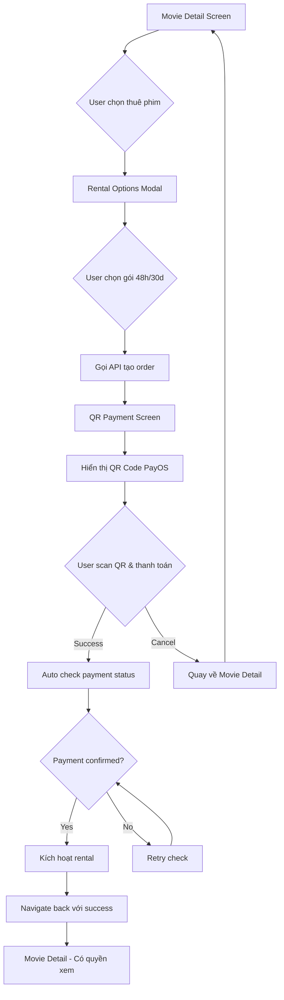
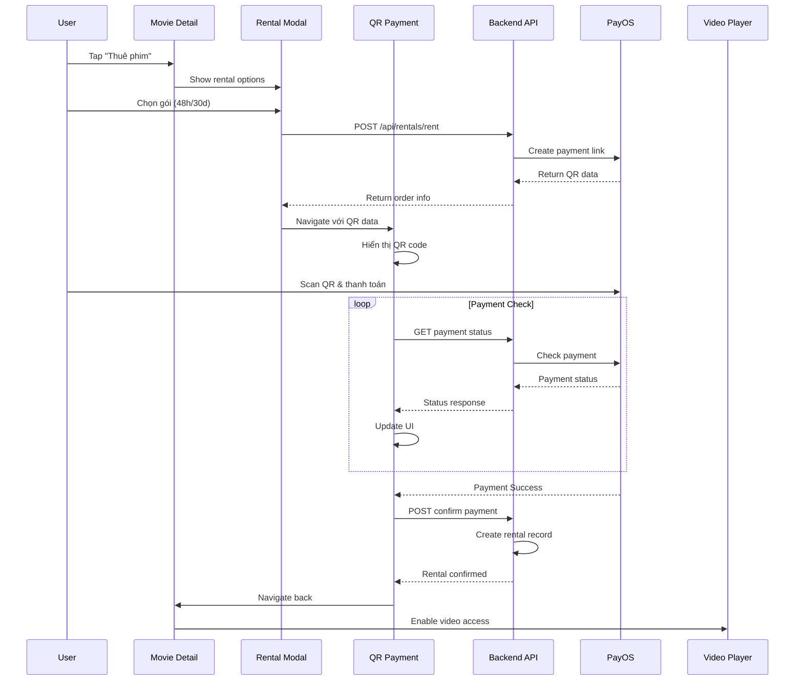

# 💳 Quy trình thanh toán QR Code - Payment Flow

## 🎯 Yêu cầu đặc biệt
**Chỉ sử dụng MỘT màn hình QR code** để thực hiện thanh toán cho tất cả các gói thuê phim.

## 🔄 Luồng xử lý thanh toán (Payment Flow)

### 1. Tổng quan flow



### 2. Diagram luồng màn hình chi tiết



## 📱 Chi tiết từng màn hình

### 1. Movie Detail Screen
**Chức năng:**
- Hiển thị thông tin phim
- Button "Thuê phim" 
- Kiểm tra trạng thái rental hiện tại

**Components:**
```tsx
<MovieDetailScreen>
  <MovieInfo />
  <RentalStatusBanner /> // Nếu đã thuê
  <ActionButtons>
    <RentButton onPress={showRentalModal} />
  </ActionButtons>
  <VideoPlayer />
</MovieDetailScreen>
```

### 2. Rental Options Modal
**Chức năng:**
- Hiển thị 2 gói: 48h và 30d
- Tính giá tự động (30% và 50% giá phim)
- Tạo order khi user chọn

**UI Elements:**
```tsx
<RentalOptionsModal>
  <MovieTitle />
  <RentalOption type="48h" price={movie.price * 0.3} />
  <RentalOption type="30d" price={movie.price * 0.5} />
  <CloseButton />
</RentalOptionsModal>
```

### 3. QR Payment Screen ⭐ (Màn hình chính)
**Chức năng:**
- Hiển thị QR code PayOS
- Auto-refresh payment status
- Countdown timer
- Xử lý success/cancel

**Layout:**
```tsx
<QRPaymentScreen>
  <Header>
    <BackButton />
    <Title>Thanh toán thuê phim</Title>
  </Header>
  
  <PaymentInfo>
    <MovieTitle />
    <RentalType />
    <Amount />
    <OrderCode />
  </PaymentInfo>
  
  <QRCodeSection>
    <QRCode value={paymentUrl} />
    <QRInstructions />
  </QRCodeSection>
  
  <PaymentStatus>
    <StatusIndicator />
    <CountdownTimer />
    <RefreshButton />
  </PaymentStatus>
  
  <ActionButtons>
    <CancelButton />
    <ManualCheckButton />
  </ActionButtons>
</QRPaymentScreen>
```

## 🔧 Implementation chi tiết

### 1. QRPaymentScreen Component

```tsx
import React, { useState, useEffect, useRef } from 'react';
import { 
  View, 
  Text, 
  StyleSheet, 
  TouchableOpacity, 
  Alert,
  ActivityIndicator,
  BackHandler 
} from 'react-native';
import QRCode from 'react-native-qrcode-svg';
import { rentalService } from '../services/rentalService';

interface Props {
  route: {
    params: {
      orderData: {
        orderCode: string;
        checkoutUrl: string;
        amount: number;
        rentalType: string;
        movieTitle: string;
        qrCode: string;
      };
      userId: string;
      movieId: string;
    };
  };
  navigation: any;
}

export const QRPaymentScreen: React.FC<Props> = ({ route, navigation }) => {
  const { orderData, userId, movieId } = route.params;
  const [paymentStatus, setPaymentStatus] = useState<'pending' | 'checking' | 'success' | 'failed'>('pending');
  const [countdown, setCountdown] = useState(900); // 15 minutes
  const [isChecking, setIsChecking] = useState(false);
  const intervalRef = useRef<NodeJS.Timeout>();
  const countdownRef = useRef<NodeJS.Timeout>();

  useEffect(() => {
    startPaymentMonitoring();
    startCountdown();
    
    // Handle back button
    const backHandler = BackHandler.addEventListener('hardwareBackPress', handleBackPress);
    
    return () => {
      stopPaymentMonitoring();
      stopCountdown();
      backHandler.remove();
    };
  }, []);

  const startPaymentMonitoring = () => {
    // Check payment status every 3 seconds
    intervalRef.current = setInterval(checkPaymentStatus, 3000);
  };

  const stopPaymentMonitoring = () => {
    if (intervalRef.current) {
      clearInterval(intervalRef.current);
    }
  };

  const startCountdown = () => {
    countdownRef.current = setInterval(() => {
      setCountdown(prev => {
        if (prev <= 1) {
          handleTimeout();
          return 0;
        }
        return prev - 1;
      });
    }, 1000);
  };

  const stopCountdown = () => {
    if (countdownRef.current) {
      clearInterval(countdownRef.current);
    }
  };

  const checkPaymentStatus = async () => {
    if (isChecking || paymentStatus === 'success') return;
    
    try {
      setIsChecking(true);
      setPaymentStatus('checking');
      
      const result = await rentalService.confirmRentalPayment(
        orderData.orderCode, 
        userId
      );
      
      // Payment successful
      setPaymentStatus('success');
      stopPaymentMonitoring();
      stopCountdown();
      
      Alert.alert(
        '🎉 Thanh toán thành công!',
        `Bạn đã thuê phim "${orderData.movieTitle}" thành công!\nGói: ${orderData.rentalType}\nSố tiền: ${orderData.amount.toLocaleString('vi-VN')} VNĐ`,
        [
          {
            text: 'Xem phim ngay',
            onPress: () => navigation.goBack()
          }
        ]
      );
      
    } catch (error) {
      setPaymentStatus('pending');
      console.log('Payment not yet confirmed:', error.message);
    } finally {
      setIsChecking(false);
    }
  };

  const handleManualCheck = () => {
    checkPaymentStatus();
  };

  const handleTimeout = () => {
    stopPaymentMonitoring();
    setPaymentStatus('failed');
    
    Alert.alert(
      'Hết thời gian thanh toán',
      'Phiên thanh toán đã hết hạn. Vui lòng thử lại.',
      [
        {
          text: 'Đóng',
          onPress: () => navigation.goBack()
        }
      ]
    );
  };

  const handleBackPress = () => {
    Alert.alert(
      'Hủy thanh toán?',
      'Bạn có chắc muốn hủy thanh toán không?',
      [
        { text: 'Tiếp tục thanh toán', style: 'cancel' },
        { 
          text: 'Hủy', 
          style: 'destructive',
          onPress: () => navigation.goBack()
        }
      ]
    );
    return true;
  };

  const formatTime = (seconds: number) => {
    const mins = Math.floor(seconds / 60);
    const secs = seconds % 60;
    return `${mins.toString().padStart(2, '0')}:${secs.toString().padStart(2, '0')}`;
  };

  const getStatusColor = () => {
    switch (paymentStatus) {
      case 'checking': return '#007AFF';
      case 'success': return '#4CAF50';
      case 'failed': return '#F44336';
      default: return '#FF9800';
    }
  };

  const getStatusText = () => {
    switch (paymentStatus) {
      case 'checking': return 'Đang kiểm tra thanh toán...';
      case 'success': return 'Thanh toán thành công!';
      case 'failed': return 'Thanh toán thất bại';
      default: return 'Vui lòng quét mã QR để thanh toán';
    }
  };

  return (
    <View style={styles.container}>
      {/* Header */}
      <View style={styles.header}>
        <TouchableOpacity onPress={handleBackPress} style={styles.backButton}>
          <Text style={styles.backButtonText}>← Quay lại</Text>
        </TouchableOpacity>
        <Text style={styles.headerTitle}>Thanh toán thuê phim</Text>
      </View>

      {/* Payment Info */}
      <View style={styles.paymentInfo}>
        <Text style={styles.movieTitle}>{orderData.movieTitle}</Text>
        <View style={styles.infoRow}>
          <Text style={styles.infoLabel}>Gói thuê:</Text>
          <Text style={styles.infoValue}>
            {orderData.rentalType === '48h' ? '48 giờ' : '30 ngày'}
          </Text>
        </View>
        <View style={styles.infoRow}>
          <Text style={styles.infoLabel}>Số tiền:</Text>
          <Text style={styles.amountValue}>
            {orderData.amount.toLocaleString('vi-VN')} VNĐ
          </Text>
        </View>
        <View style={styles.infoRow}>
          <Text style={styles.infoLabel}>Mã đơn hàng:</Text>
          <Text style={styles.infoValue}>{orderData.orderCode}</Text>
        </View>
      </View>

      {/* QR Code Section */}
      <View style={styles.qrSection}>
        <View style={styles.qrContainer}>
          <QRCode
            value={orderData.checkoutUrl}
            size={200}
            backgroundColor="white"
            color="black"
          />
        </View>
        <Text style={styles.qrInstructions}>
          Mở app ngân hàng và quét mã QR để thanh toán
        </Text>
      </View>

      {/* Payment Status */}
      <View style={styles.statusSection}>
        <View style={[styles.statusIndicator, { backgroundColor: getStatusColor() }]}>
          {isChecking && <ActivityIndicator size="small" color="white" />}
        </View>
        <Text style={[styles.statusText, { color: getStatusColor() }]}>
          {getStatusText()}
        </Text>
        
        {paymentStatus === 'pending' && (
          <View style={styles.countdownContainer}>
            <Text style={styles.countdownLabel}>Thời gian còn lại:</Text>
            <Text style={styles.countdownTimer}>{formatTime(countdown)}</Text>
          </View>
        )}
      </View>

      {/* Action Buttons */}
      <View style={styles.actionButtons}>
        <TouchableOpacity 
          style={styles.refreshButton}
          onPress={handleManualCheck}
          disabled={isChecking || paymentStatus === 'success'}
        >
          <Text style={styles.refreshButtonText}>
            {isChecking ? 'Đang kiểm tra...' : 'Kiểm tra thanh toán'}
          </Text>
        </TouchableOpacity>
        
        <TouchableOpacity 
          style={styles.cancelButton}
          onPress={handleBackPress}
          disabled={paymentStatus === 'success'}
        >
          <Text style={styles.cancelButtonText}>Hủy thanh toán</Text>
        </TouchableOpacity>
      </View>
    </View>
  );
};

const styles = StyleSheet.create({
  container: {
    flex: 1,
    backgroundColor: '#000',
  },
  header: {
    flexDirection: 'row',
    alignItems: 'center',
    padding: 16,
    paddingTop: 50,
    borderBottomWidth: 1,
    borderBottomColor: '#333',
  },
  backButton: {
    marginRight: 16,
  },
  backButtonText: {
    color: '#007AFF',
    fontSize: 16,
  },
  headerTitle: {
    color: '#fff',
    fontSize: 18,
    fontWeight: 'bold',
  },
  paymentInfo: {
    padding: 20,
    backgroundColor: '#111',
    margin: 16,
    borderRadius: 12,
  },
  movieTitle: {
    color: '#fff',
    fontSize: 18,
    fontWeight: 'bold',
    marginBottom: 16,
    textAlign: 'center',
  },
  infoRow: {
    flexDirection: 'row',
    justifyContent: 'space-between',
    marginBottom: 8,
  },
  infoLabel: {
    color: '#ccc',
    fontSize: 14,
  },
  infoValue: {
    color: '#fff',
    fontSize: 14,
    fontWeight: '500',
  },
  amountValue: {
    color: '#4CAF50',
    fontSize: 16,
    fontWeight: 'bold',
  },
  qrSection: {
    alignItems: 'center',
    marginVertical: 32,
  },
  qrContainer: {
    backgroundColor: 'white',
    padding: 20,
    borderRadius: 12,
    marginBottom: 16,
  },
  qrInstructions: {
    color: '#ccc',
    fontSize: 14,
    textAlign: 'center',
    maxWidth: 280,
  },
  statusSection: {
    alignItems: 'center',
    marginVertical: 20,
  },
  statusIndicator: {
    width: 12,
    height: 12,
    borderRadius: 6,
    marginBottom: 8,
    justifyContent: 'center',
    alignItems: 'center',
  },
  statusText: {
    fontSize: 16,
    fontWeight: '500',
    marginBottom: 12,
  },
  countdownContainer: {
    alignItems: 'center',
  },
  countdownLabel: {
    color: '#ccc',
    fontSize: 14,
    marginBottom: 4,
  },
  countdownTimer: {
    color: '#FF9800',
    fontSize: 18,
    fontWeight: 'bold',
  },
  actionButtons: {
    padding: 20,
    gap: 12,
  },
  refreshButton: {
    backgroundColor: '#007AFF',
    padding: 16,
    borderRadius: 8,
    alignItems: 'center',
  },
  refreshButtonText: {
    color: '#fff',
    fontSize: 16,
    fontWeight: '600',
  },
  cancelButton: {
    backgroundColor: '#444',
    padding: 16,
    borderRadius: 8,
    alignItems: 'center',
  },
  cancelButtonText: {
    color: '#fff',
    fontSize: 16,
  },
});
```

### 2. Navigation Integration

```tsx
// Trong RentalOptionsModal
const handleRental = async (rentalType: '48h' | '30d') => {
  try {
    setLoading(true);
    
    const result = await rentalService.createRentalOrder(
      userId, 
      movie._id, 
      rentalType
    );

    // Navigate đến QR Payment Screen thay vì mở browser
    navigation.navigate('QRPayment', {
      orderData: result.data,
      userId,
      movieId: movie._id
    });
    
    onClose(); // Đóng modal
    
  } catch (error) {
    Alert.alert('Lỗi', error.message);
  } finally {
    setLoading(false);
  }
};
```

### 3. Stack Navigator Setup

```tsx
// Trong navigation stack
<Stack.Screen 
  name="QRPayment" 
  component={QRPaymentScreen}
  options={{
    headerShown: false,
    gestureEnabled: false, // Không cho swipe back
  }}
/>
```

## 🎨 UI/UX Considerations

### 1. Visual Design
- **Dark theme** để phù hợp với app phim
- **QR code nổi bật** với background trắng
- **Status indicators** với màu sắc rõ ràng
- **Countdown timer** để tạo urgency

### 2. User Experience
- **Auto-refresh** payment status mỗi 3 giây
- **Manual refresh** button cho user control
- **Clear instructions** cho việc scan QR
- **Timeout handling** với 15 phút limit
- **Back button confirmation** để tránh thoát nhầm

### 3. Error Handling
- Network errors
- Payment timeouts
- Invalid QR codes
- Server errors

## 📊 State Management

```typescript
interface PaymentState {
  status: 'pending' | 'checking' | 'success' | 'failed';
  orderData: OrderData;
  countdown: number;
  isChecking: boolean;
}

// Redux slice hoặc Context
const paymentSlice = createSlice({
  name: 'payment',
  initialState,
  reducers: {
    setPaymentStatus: (state, action) => {
      state.status = action.payload;
    },
    decrementCountdown: (state) => {
      state.countdown -= 1;
    },
    setChecking: (state, action) => {
      state.isChecking = action.payload;
    }
  }
});
```

## 🔄 Complete Flow Summary

1. **Movie Detail** → Tap "Thuê phim"
2. **Rental Modal** → Chọn gói 48h/30d
3. **API Call** → Tạo PayOS order
4. **QR Screen** → Hiển thị QR code (MAIN SCREEN)
5. **User Scan** → Thanh toán qua app ngân hàng
6. **Auto Check** → Backend check payment status
7. **Success** → Navigate back với rental activated
8. **Video Player** → Có quyền xem phim

**Lưu ý quan trọng:** Toàn bộ process thanh toán chỉ diễn ra trên 1 màn hình QR duy nhất, không cần mở browser hay app external. 